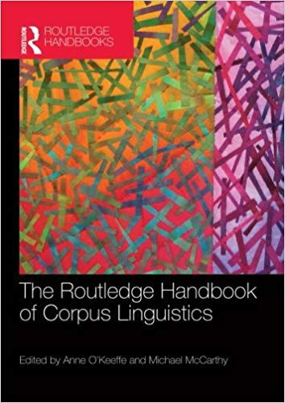
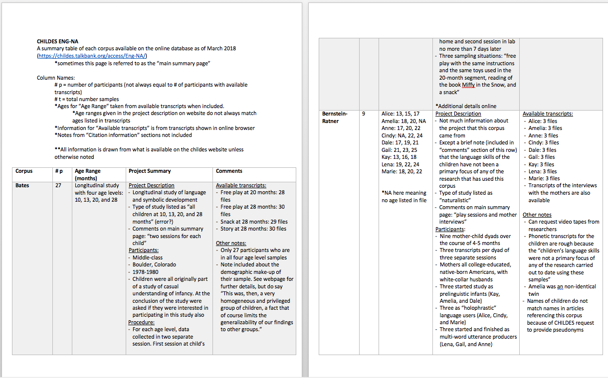
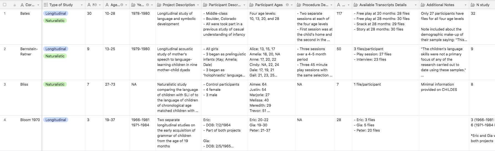
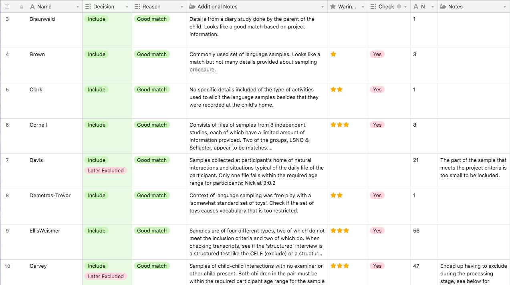

```{r setup, include=FALSE}
#options(knitr.table.format = "html") 
knitr::opts_chunk$set(warning = FALSE, message = FALSE, dpi = 300)

library(tidyverse)
library(knitr)
library(kableExtra)
library(ggrepel)
```

# CHILDES Database
- Child Language Data Exchange System (CHILDES)

--

    - Online repository of language acquisition data

--

- CHILDES → Eng-NA 

--

    + Collection of English North American corpora

    + **54** corpora

---
### The Routledge Handbook of Corpus Linguistics
*O'Keeffe, Anne, and Michael McCarthy. Routledge, 2010.*

```{r echo = FALSE, fig.align = "center", out.width = "25%"}

```

--

> "...Bringing together experts in the key areas of development and change, the handbook is structured around six themes which take the reader through building and designing a corpus to using a corpus to study literature and translation..."


https://www.routledge.com/The-Routledge-Handbook-of-Corpus-Linguistics/OKeeffe-McCarthy/p/book/9780415464895
---

# Inclusion/Exclusion Criteria
### General
--

- Part of the Eng-NA section of CHILDES

- Sufficient information about the details of the study and corpus is available

--

### Participants

--
 
- 36 - 96 months old

--

- English as first and primary language

--

- No reported gross sensory impairments (e.g. hearing impairment), congenital defects, developmental disabilities, or atypical development

--

- No siginificant/regular exposure to another language

--

    + i.e. 75% or higher consistent exposure to a language other than English

---
### Language Samples

--

- Naturalistic and unscripted elicitations (in either naturalistic or laboratory settings)


--

- Intelligible speech

--

- One-on-one conversations (e.g. child-examiner conversations or parent-child conversations)

--

    + Can be child-child conversations as long as both children meet the participant requirements

    + No conversations amongst a group of children

---
### Language Samples continued
- No reading from books, etc.

--

- No restricted vocabulary that is caused by the structure of the study or the experiment design

--

    + e.g. no samples of free play sesssions for multiple participants that each involve the same set of experimenter-provided toys
    
--

- No structured speech

--

    + e.g. speech from an interview that has been tailored for a specific experimental interest(s)

---
## Summary Table - *Word Doc*




---
## Summary Table - *Airtable*



(*in progress*)

---
## Decision Table - *Airtable*



---
class: inverse, center, middle
# . . .

---

## 54 Corpora → 14 Corpora

.pull-left[
- `Bloom70`
- `Braunwald`
- `Brown`
- `Clark`
- `Cornell`
- `Demetras1`
- `EllisWeismer`]

.pull-right[
- `Hall`
- `Kuczaj`
- `MacWhinney`
- `Sachs`
- `Suppes`
- `Warren`
- `Weist`]


---
class: inverse, center, middle

# Cleaning, processing, & normalizing

---
## Filtering data

- Filtered transcripts & utterances against the inclusion/exclusion criteria as applicable

--

    + 36-96 months
    
    + No reading from books, etc.
    
    + No restricted vocabulary
    
---
class: center
### Transcripts per corpora after filtering

```{r echo = FALSE}
stats <- read_csv("data/stats.csv")

stats %>% 
  select(corpus, n_trns) %>% 
  arrange(n_trns) %>% 
  kable() %>% 
  kable_styling()
```

---
class: center
### Type-token ratio per corpus after filtering and BEFORE normalization
```{r echo = FALSE, fig.align = "center", out.width = "65%"}
ggplot(stats, aes(reorder(corpus, -fil_ttr), fil_ttr, label = corpus)) +
  geom_col(fill = "darkslategrey", alpha = 0.75) +
  labs(y = "type-token ratio", x = "corpus", title = "Before Normalization") +
  theme_minimal() +
  theme(axis.text.x = element_text(angle = 45)) 
```

---
## The transcripts are extremely messy...

--

.pull-left[
 ### 1. Plus signs
```{r echo = FALSE}
tokens_not_normed <- read_csv("data/tokens_not_normed.csv")

plus_signs <- tokens_not_normed %>% 
  filter(str_detect(word, "\\+")) %>% 
  count(word, sort = TRUE) 

plus_signs %>% 
  head()
```
]

--

.pull-right[
### 2. Underscores
```{r echo = FALSE}
underscores <- tokens_not_normed %>% 
  filter(str_detect(word, "_")) %>% 
  count(word, sort = TRUE)

underscores %>% 
  head() 
```
]

---
.pull-left[
### 3. Capitalized words with underscores
```{r echo = FALSE}
prop_np <- tokens_not_normed %>% 
  filter(str_detect(word, "_")) %>% 
  filter(str_detect(word, "[:upper:]")) %>% 
  count(word, sort = TRUE)

prop_np %>% 
  head()
```
]

--

.pull-right[
### 4. Capitalized words without underscores
```{r echo = FALSE}
prop_n <- tokens_not_normed %>% 
  filter(!str_detect(word, "_")) %>% 
  filter(str_detect(word, "[:upper:]")) %>% 
  count(word, sort = TRUE)

prop_n %>% 
  head()
```
]

---
class: inverse, center, middle
# Normalization

---
# 1. Normalizing plus signs

Considered three possible mappings:   

--

### Case 1: Connect

* e.g. *merry+go+round* → *merry_go_round*

--

### Case 2: Collapse

* e.g. *bath+room* → *bathroom*

--

### Case 3: Separate

* e.g. *orange+juice* → *orange juice*
    
---
# 1. Normalizing plus signs

### Used the CMU Pronouncing Dictionary as the standard to compare to

--

> *"The Carnegie Mellon University Pronouncing Dictionary is an open-source machine-readable pronunciation dictionary for North American English that contains over 134,000 words and their pronunciations."*"

http://www.speech.cs.cmu.edu/cgi-bin/cmudict

---
# 1. Normalizing plus signs

### Mapping

* Check if *connected* version exists in the CMU dictionary. 

--

    + If it exists, then map the word to the *connected* version
    + e.g. *merry_go_round*
    
--
    
* If not, check if *collapsed* version exists in the CMU dictionary

--

    + If it exists, then map the word to the *collapsed* version
    + e.g. *bathroom*

--

* If not, map to the *separated version*
    + e.g. *orange juice*

---
# 2. & 3. Normalizing underscores +/- capitalized words

* If phrase contains at least 1 capitalized word...

--

    + ...map to **"_prop_np_"**
    
    + e.g. *New_York*, *Humpty_Dumpty*, *Miss_Swww*
  
--

* If phrase is an acronym or initialism...

--

    + ...map to the colllapsed version
    
    + e.g. *c_d* → *cd*, *d_v_d* → *dvd*, *t_v* → *tv*

--

* Otherwise...map to the separated version

--

    + e.g. *has_to* → *has to*, *a_lot_of* → *a lot of*, *thank_you* → *thank you*, *okey_dokey* → *okey dokey*
    
---
# 4. Capitalized words w/out underscores

--

* Exceptions: I'm, I'll, I've, I'd, I'mma

    + Change to lowercase

--

* If only one letter...
    
    + Change to lowercase
    
    + e.g. I, "M and M's", "A B C..."
    
--

* Otherwise...

    + Change to **"_prop_n_"**
    
---

# 5. Contractions
    
* For unambiguous cases, 

--
    + Map to expanded version

    + e.g. *don't* → *do not*, *I'm* → *i am*

--

* For ambiguous cases

--

    + Remove apostrophe and collapse into one word

    + e.g. *it's* → *its*, *we'd* → *wed*
 
---

# Type-token ratio per corpus
```{r echo = FALSE,  fig.align = "center", out.width = "65%"}
ggplot(stats, aes(reorder(corpus, -fil_ttr), fil_ttr, label = corpus)) +
  geom_col(fill = "darkslategrey", alpha = 0.75) +
  labs(y = "type-token ratio", x = "corpus", title = "Before Normalization") +
  theme_minimal() +
  theme(axis.text.x = element_text(angle = 45)) 
```


---
# Type-token ratio per corpus
```{r echo = FALSE, fig.align = "center", out.width = "65%"}
ggplot(stats, aes(reorder(corpus, -fil_ttr), fil_ttr, label = corpus)) +
  geom_col(fill = "darkslategrey", alpha = 0.75) +
  geom_col(aes(reorder(corpus, -fil_ttr), norm_ttr), fill = "blue", alpha = 0.4) +
  labs(y = "type-token ratio", x = "corpus", title = "Before & After Normalization") +
  theme_minimal() +
  theme(axis.text.x = element_text(angle = 45)) 
```

---
class: center
## Types changed = 5,104

--

.pull-left[
### Total Tokens:
#### 1,031,357 → 1,068,978

### Total Types:
#### 19,508 → 14,719
]

--

.pull-right[
### Total _prop_np_ tokens
#### 1,790


### Total _prop_n_ tokens 
#### 28,141
]

---
# Next Steps

#### dat, dis, dese, dere, dey  

--

#### eledator, wif, wabbit, wegular

--

#### lellow (yellow), thith (this?), weg (leg?), berember (remember?)  

--

#### sientate, beso

--

#### afraidiecats, afraidiedog

--

#### wiggleworm

--

#### supercalifragilisticexpialidocious

---
# Next Steps

#### ahnnuhthuh, aenfuhnee, ahlovuhhuhfezs

--

#### ahpuhbuhbuhbuhbuh

--

#### boinkbawinkbockabanikae

--

### babobohmhmhmdoodoodoodootdoodoodoodo

--

## amuchaagelaamedaleguelalalalalalalaigueleleduhduh

